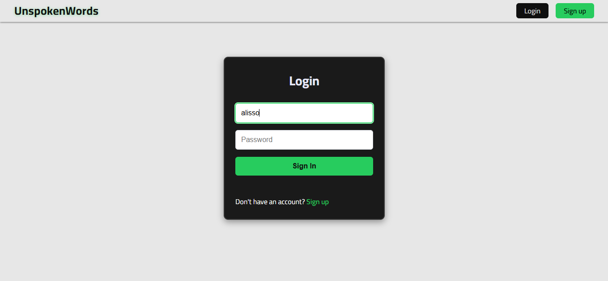
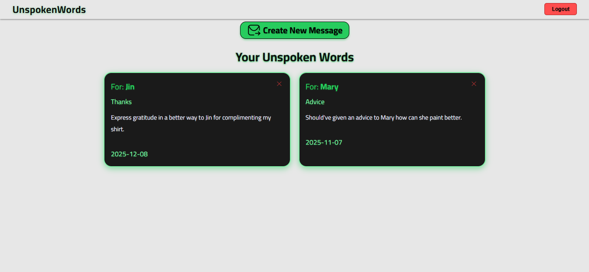
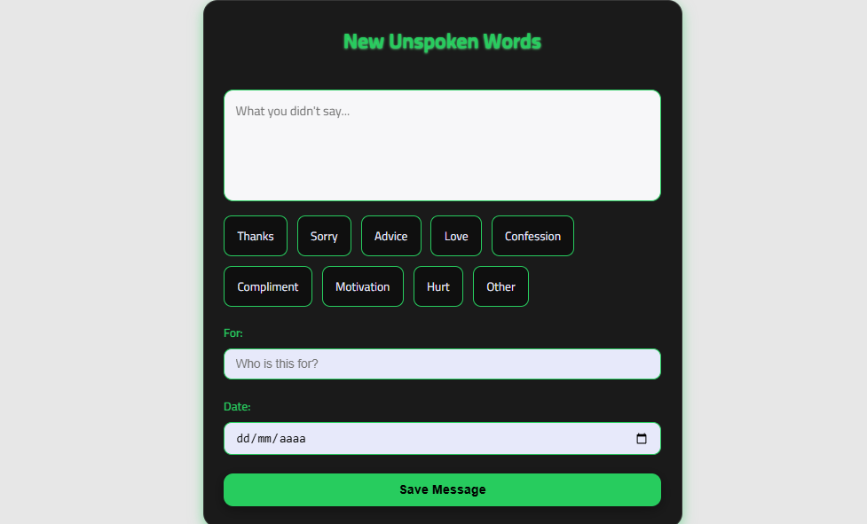

# 📝 Unspoken Words

A web application where users can write and store words they never said.

## 🚀 Features

- User authentication (JWT + HttpOnly cookies)
- Create personal messages
- View your own messages
- Delete messages
- Categories for unspoken words

## 🛠️ Tech Stack

### Backend
- Java 21
- Spring Boot
- Spring Security
- JPA / Hibernate
- PostgreSQL
- JWT Authentication

### Frontend
- React
- Vite
- Axios
- CSS

## 📸 Screenshots

### Login

### My Unspoken Words

### New Message

## 📌 API Documentation

| Method | Route          | Description    |
| ------ | -------------- | -------------- |
| POST   | /auth/login    | Login          |
| POST   | /auth/singup   | Register       |
| POST   | /auth/logout   | Logout         |
| POST   | /messages      | Create message |
| GET    | /messages      | List messages  |
| DELETE | /messages/{id} | Delete message |

## 🧑‍💻 Author

- Alisson Teles Fraga [@alissontfraga](https://github.com/alissontfraga)

